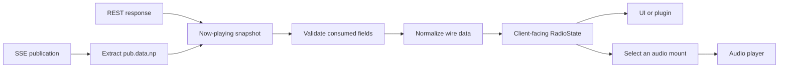

Building a Code Radio client is less about sending an HTTP request and more about
deciding what the response means. Which fields describe a song? Which value
identifies one particular play? Why does the SSE endpoint wrap the same data in
several extra objects? Which parts should the rest of an application be allowed
to see?

This article answers those questions by walking through real responses from
[freeCodeCamp Code Radio](https://coderadio.freecodecamp.org). We will start with
the wire format, compare the REST and Server-Sent Events payloads, and then turn
them into a smaller model that a player, Neovim plugin, status bar, or terminal UI
can use without knowing the transport details.

The examples were verified on September 20, 2026. Code Radio runs on
[AzuraCast](https://www.azuracast.com/), so the public payload follows
AzuraCast's now-playing model and may evolve with the service.

## Three interfaces, three different jobs

Code Radio exposes three useful public interfaces:

| Interface | What it returns | What a client uses it for |
| --- | --- | --- |
| REST snapshot | One JSON document describing the station and current playback | Initial state, refresh, and recovery |
| SSE stream | A sequence of events, some of which contain a new snapshot | Live metadata updates |
| MP3 stream | A continuous audio response | Playback |

The endpoints used in this article are:

```text
REST
https://coderadio-admin-v2.freecodecamp.org/api/nowplaying_static/coderadio.json

SSE
https://coderadio-admin-v2.freecodecamp.org/api/live/nowplaying/sse?cf_connect=%7B%22subs%22%3A%7B%22station%3Acoderadio%22%3A%7B%7D%7D%7D

Default audio stream
https://coderadio-admin-v2.freecodecamp.org/listen/coderadio/radio.mp3
```

At the time of verification, all three worked without authentication. Treat the
long `cf_connect` query parameter as an opaque subscription description. It is a
transport detail, not part of the radio model we are about to design.

## Start with a REST snapshot

Fetch the current state with `curl`:

```bash
curl --fail --silent \
  https://coderadio-admin-v2.freecodecamp.org/api/nowplaying_static/coderadio.json \
  | jq
```

The response is large, but its top-level shape is easy to read:

```jsonc
{
  "station": { /* station identity and available streams */ },
  "listeners": { /* current listener counts */ },
  "live": { /* live-DJ state */ },
  "now_playing": { /* the current play and its song */ },
  "playing_next": { /* the scheduled next song */ },
  "song_history": [ /* previous plays */ ],
  "is_online": true,
  "cache": "event"
}
```

This is a snapshot, not merely a song object. It mixes four kinds of data:

1. station configuration;
2. delivery information such as MP3 mounts;
3. mutable playback state;
4. schedule and history data.

That distinction is useful because most applications need only a small subset of
the full document.

## Read the response from the outside in

### `station`: identity and delivery options

A shortened `station` object looks like this:

```jsonc
{
  "id": 1,
  "name": "freeCodeCamp.org Code Radio",
  "shortcode": "coderadio",
  "listen_url": "https://coderadio-admin-v2.freecodecamp.org/listen/coderadio/radio.mp3",
  "is_public": true,
  "mounts": [
    {
      "id": 1,
      "name": "128kbps MP3",
      "url": "https://coderadio-admin-v2.freecodecamp.org/listen/coderadio/radio.mp3",
      "bitrate": 128,
      "format": "mp3",
      "is_default": true,
      "listeners": {
        "total": 37,
        "unique": 35,
        "current": 37
      }
    },
    {
      "id": 2,
      "name": "64kbps MP3",
      "url": "https://coderadio-admin-v2.freecodecamp.org/listen/coderadio/low.mp3",
      "bitrate": 64,
      "format": "mp3",
      "is_default": false,
      "listeners": {
        "total": 3,
        "unique": 3,
        "current": 3
      }
    }
  ]
}
```

There are two useful levels of abstraction here:

- `station.listen_url` is the server's current default stream.
- `station.mounts` lets an application offer an explicit quality choice.

A client should prefer these returned URLs over duplicating stream URLs in its
own configuration. If Code Radio changes its host or default mount, the client
can follow the response instead of requiring a release.

### `now_playing`: a play containing a song

The most important nesting decision in the schema is that a song and a play are
different objects:

```jsonc
{
  "sh_id": 389589,
  "played_at": 1789890397,
  "duration": 307,
  "elapsed": 97,
  "remaining": 210,
  "playlist": "default",
  "is_request": false,
  "song": {
    "id": "fdb32cf57b92fce061ae187f56d38e3f",
    "text": "Uyama Hiroto - One Day",
    "artist": "Uyama Hiroto",
    "title": "One Day",
    "album": "Freedom of the son",
    "genre": "Jazz",
    "isrc": "",
    "lyrics": "",
    "art": "https://coderadio-admin-v2.freecodecamp.org/api/station/coderadio/art/...jpg",
    "custom_fields": []
  }
}
```

The two IDs answer different questions:

- `song.id` identifies the media item.
- `now_playing.sh_id` identifies this occurrence in the station history.

If the same song is played twice, `song.id` can be the same while `sh_id` changes.
Use `sh_id` to detect a new play and reset UI state. Use `song.id` for track-level
tasks such as caching artwork or associating local metadata.

The timing fields are measured in seconds:

```text
played_at  Unix timestamp at which this play started
duration   total track duration
elapsed    elapsed time when the snapshot was produced
remaining  remaining time when the snapshot was produced
```

`elapsed` is already stale by the time a client renders it. Store the local time
at which the snapshot was observed, then advance the progress locally until the
next server update arrives.

### `listeners`, `playing_next`, and `song_history`

The station-wide listener object currently contains three integer fields:

```json
{
  "total": 41,
  "unique": 41,
  "current": 41
}
```

For a simple UI, `listeners.current` is the useful display value. Avoid building
business logic around the relationship among these counters unless your client
has a specific need for AzuraCast's listener accounting semantics.

`playing_next.song` and each `song_history[n].song` use the same song shape as
`now_playing.song`. Their surrounding objects describe different events:

```text
now_playing   the active play, including elapsed and remaining time
playing_next  the scheduled next item, including its expected start
song_history  completed or previous plays, each with its own sh_id
```

This repetition is a hint for the client model: define `Song` once, then place it
inside separate `CurrentPlay`, `NextPlay`, and `HistoricalPlay` structures only
when the application needs those distinctions.

## The SSE stream carries the same snapshot in an envelope

Connect with `curl -N` so that output is not buffered:

```bash
curl --no-buffer \
  'https://coderadio-admin-v2.freecodecamp.org/api/live/nowplaying/sse?cf_connect=%7B%22subs%22%3A%7B%22station%3Acoderadio%22%3A%7B%7D%7D%7D'
```

An SSE connection does not begin with a now-playing document. The first frame is
usually connection metadata:

```text
data: {"connect":{"client":"...","subs":{"station:coderadio":{...}},"ping":25,...}}
```

Publication frames have a different shape:

```jsonc
{
  "channel": "station:coderadio",
  "pub": {
    "data": {
      "np": { /* the same snapshot shape returned by REST */ },
      "triggers": ["listener_lost"],
      "current_time": 1789890498
    },
    "offset": 4388786
  }
}
```

The path to the reusable document is therefore:

```text
pub.data.np
```

Connection frames, keepalives, and malformed messages do not have that path and
should be ignored. Once `np` has been extracted, the same validator and
normalizer used for the REST response can handle it.



This is the central design idea: REST and SSE are two transports for one domain
snapshot. The rest of the application should not maintain two models.

## Model only the fields your application consumes

The live response contains more fields than a small client needs. A useful
boundary schema validates the fields the application consumes and ignores the
rest. The following example uses Zod, but the same separation applies in Rust,
Go, Python, or Lua.

```ts title="code-radio-schema.ts"
import { z } from "zod";

const SongSchema = z.object({
  id: z.string(),
  title: z.string(),
  artist: z.string(),
  album: z.string(),
  art: z.string(),
});

const MountSchema = z.object({
  id: z.number(),
  name: z.string(),
  url: z.string().url(),
  bitrate: z.number(),
  format: z.string(),
  is_default: z.boolean(),
});

export const SnapshotSchema = z.object({
  station: z.object({
    name: z.string(),
    listen_url: z.string().url(),
    mounts: z.array(MountSchema),
  }),
  listeners: z.object({
    current: z.number(),
  }),
  now_playing: z.object({
    sh_id: z.number(),
    played_at: z.number(),
    duration: z.number(),
    elapsed: z.number(),
    remaining: z.number(),
    song: SongSchema,
  }),
  is_online: z.boolean(),
});

export type Snapshot = z.infer<typeof SnapshotSchema>;
```

Zod strips unrecognized object keys by default. This gives the application a
small, deliberate dependency on the upstream response while still rejecting a
payload that no longer contains the fields it needs.

The wire schema is still not the model exposed to the UI. Normalize names,
remove empty strings, and preserve the distinction between a play ID and a song
ID:

```ts title="radio-state.ts"
import type { Snapshot } from "./code-radio-schema";

export type AudioSource = {
  id: number;
  label: string;
  url: string;
  bitrateKbps: number;
  format: string;
  isDefault: boolean;
};

export type RadioState = {
  stationName: string;
  defaultStreamUrl: string;
  online: boolean;
  listeners: number;
  playId: number;
  track: {
    id: string;
    title: string;
    artist: string;
    album?: string;
    artworkUrl?: string;
  };
  timing: {
    startedAt: number;
    duration: number;
    elapsedAtObservation: number;
    observedAt: number;
  };
  sources: AudioSource[];
};

function optionalText(value: string): string | undefined {
  const text = value.trim();
  return text.length > 0 ? text : undefined;
}

export function toRadioState(
  snapshot: Snapshot,
  observedAt = Math.floor(Date.now() / 1000),
): RadioState {
  const current = snapshot.now_playing;

  return {
    stationName: snapshot.station.name,
    defaultStreamUrl: snapshot.station.listen_url,
    online: snapshot.is_online,
    listeners: snapshot.listeners.current,
    playId: current.sh_id,
    track: {
      id: current.song.id,
      title: current.song.title,
      artist: current.song.artist,
      album: optionalText(current.song.album),
      artworkUrl: optionalText(current.song.art),
    },
    timing: {
      startedAt: current.played_at,
      duration: current.duration,
      elapsedAtObservation: current.elapsed,
      observedAt,
    },
    sources: snapshot.station.mounts.map((mount) => ({
      id: mount.id,
      label: mount.name,
      url: mount.url,
      bitrateKbps: mount.bitrate,
      format: mount.format,
      isDefault: mount.is_default,
    })),
  };
}
```

The upper layers now work with stable application terms such as `playId`,
`track`, and `sources`; they do not know about `sh_id`, snake_case fields, or the
SSE envelope.

## Derive progress and stream selection above the transport layer

Once the response has been normalized, useful behavior becomes small and easy to
test.

Project the elapsed time between server updates:

```ts
import type { RadioState } from "./radio-state";

export function projectedElapsed(
  state: RadioState,
  now = Math.floor(Date.now() / 1000),
): number {
  const elapsed =
    state.timing.elapsedAtObservation + (now - state.timing.observedAt);

  return state.timing.duration > 0
    ? Math.max(0, Math.min(elapsed, state.timing.duration))
    : Math.max(0, elapsed);
}
```

Choose an audio stream from the returned mounts:

```ts
import type { RadioState } from "./radio-state";

export function selectStreamUrl(
  state: RadioState,
  preferredBitrate = 128,
): string {
  return (
    state.sources.find((source) => source.bitrateKbps === preferredBitrate)
      ?.url ??
    state.sources.find((source) => source.isDefault)?.url ??
    state.sources[0]?.url ??
    state.defaultStreamUrl
  );
}
```

These functions do not perform HTTP requests and do not know whether the state
came from REST or SSE. They can be reused by a CLI, an editor plugin, or a web UI.

## Put REST and SSE behind one small adapter

The adapter below validates REST snapshots and extracts snapshots from SSE
publication frames. It deliberately does not own audio playback.

```ts title="code-radio-api.ts"
import { z } from "zod";
import { SnapshotSchema } from "./code-radio-schema";
import { toRadioState, type RadioState } from "./radio-state";

const REST_URL =
  "https://coderadio-admin-v2.freecodecamp.org/api/nowplaying_static/coderadio.json";

export const SSE_URL =
  "https://coderadio-admin-v2.freecodecamp.org/api/live/nowplaying/sse" +
  "?cf_connect=%7B%22subs%22%3A%7B%22station%3Acoderadio%22%3A%7B%7D%7D%7D";

const PublicationSchema = z.object({
  pub: z
    .object({
      data: z.object({
        np: SnapshotSchema,
        current_time: z.number().optional(),
      }),
    })
    .optional(),
});

export async function fetchRadioState(): Promise<RadioState> {
  const response = await fetch(REST_URL);
  if (!response.ok) {
    throw new Error(`Code Radio returned HTTP ${response.status}`);
  }

  const snapshot = SnapshotSchema.parse(await response.json());
  return toRadioState(snapshot);
}

export function decodeSseData(data: string): RadioState | undefined {
  let json: unknown;

  try {
    json = JSON.parse(data);
  } catch {
    return undefined;
  }

  const result = PublicationSchema.safeParse(json);
  const publication = result.success ? result.data.pub : undefined;
  if (!publication) return undefined;

  return toRadioState(
    publication.data.np,
    publication.data.current_time,
  );
}
```

A browser can connect the adapter to `EventSource`:

```ts
import {
  decodeSseData,
  fetchRadioState,
  SSE_URL,
} from "./code-radio-api";

let state = await fetchRadioState();
render(state);

const events = new EventSource(SSE_URL);

events.onmessage = (event) => {
  const next = decodeSseData(event.data);
  if (!next) return;

  const playChanged = next.playId !== state.playId;
  state = next;
  render(state, { playChanged });
};

events.onerror = () => {
  // EventSource reconnects automatically. Surface the degraded state in the UI.
  showConnectionWarning();
};
```

In Node.js, Rust, or Neovim, replace `EventSource` with the environment's SSE
transport and keep the same boundary: each complete `data:` event is passed to a
decoder, and only normalized `RadioState` objects reach the application.

## Audio is a stream, not another metadata response

The selected mount URL returns `audio/mpeg`. It is an open-ended response: bytes
continue arriving while the station is playing. Do not wait for the response to
finish or try to load it as a normal file.

For a Neovim plugin, delegating playback to a system player keeps audio decoding
out of the plugin process:

```lua
local job_id = vim.fn.jobstart({
  "mpv",
  "--no-video",
  "--volume=90",
  selected_source.url,
})

-- Later:
vim.fn.jobstop(job_id)
```

The Rust [code-radio-cli](https://github.com/JasonWei512/code-radio-cli) takes a
different approach: it fetches the stream, decodes MP3 data incrementally, and
sends it to `rodio`. Both designs consume the same mount URL. The choice belongs
to the playback layer and should not affect the metadata model.

## Practical schema rules

The examples above lead to a few rules that make a wrapper more resilient:

1. Use REST to obtain initial state; an SSE stream can take time to deliver its
   first publication.
2. Extract `pub.data.np` from publication events and ignore other SSE frames.
3. Validate at the transport boundary and expose a smaller domain model.
4. Use `sh_id` as the identity of a play and `song.id` as the identity of a
   track.
5. Treat empty metadata strings as missing values.
6. Project progress locally, then resynchronize whenever a server snapshot
   arrives.
7. Select audio from `station.mounts` or `station.listen_url` instead of
   hard-coding a quality URL throughout the application.
8. Keep audio playback separate from metadata fetching and event handling.
9. Ignore unknown upstream fields so additive schema changes do not break the
   client.
10. Log validation failures with enough context to notice a real upstream schema
    change.

With those boundaries in place, Code Radio's large response becomes a compact
and reusable client contract:

```text
snapshot in -> validate -> normalize -> RadioState -> UI and player decisions
```

That contract is the useful abstraction. The REST URL, SSE envelope, snake_case
field names, and MP3 transport can change independently while the rest of the
application continues to speak in terms of tracks, plays, progress, listeners,
and audio sources.

## Sources and verification

- [Code Radio](https://coderadio.freecodecamp.org/)
- [code-radio-cli](https://github.com/JasonWei512/code-radio-cli), including its
  [API adapter](https://github.com/JasonWei512/code-radio-cli/blob/799d74867b0d9c069251a4fac1c7fa7aaa54da17/src/code_radio_api.rs)
  and
  [response models](https://github.com/JasonWei512/code-radio-cli/blob/799d74867b0d9c069251a4fac1c7fa7aaa54da17/src/models/code_radio.rs)
- [AzuraCast now-playing data documentation](https://www.azuracast.com/docs/developers/now-playing-data/)

The REST shape, SSE envelope, public access, mount URLs, and 128 kbps MP3 response
were checked against the live Code Radio service on September 20, 2026.
