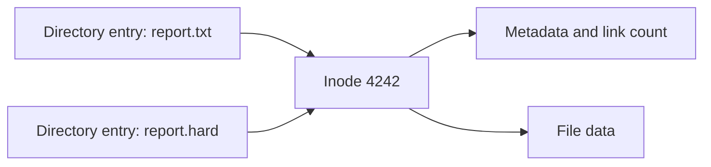

The shortest explanation of `ln` is easy to memorize:

```text
ln TARGET LINK_NAME       create a hard link
ln -s TARGET LINK_NAME    create a symbolic link
```

It is also too shallow to be useful when something surprising happens. Why does
deleting the "original" leave a hard link intact? Why can a program keep reading
a file after every visible name has been removed? Why does replacing a file
sometimes break the relationship between two hard links? Why is a relative
symbolic link interpreted from a directory you may not expect?

This is the first article in **Understanding Linux Through Commands**, a series
about learning command-line tools by observing the operating-system model beneath
them. We will use `ln`, `stat`, `readlink`, and a few shell primitives to derive
that model from actual behavior.

The commands target GNU/Linux. GNU `stat` options such as `-c`, GNU `mv -T`, and
some `ln` options differ on macOS and BSD systems.

## Build a disposable lab

Create a fresh directory under the system temporary directory:

```bash
lab_dir=$(mktemp -d --tmpdir ln-lab.XXXXXX)
cd "$lab_dir"
printf 'Working in %s\n' "$PWD"
```

Every destructive command in this article stays inside that directory. Keep the
terminal open so that `$lab_dir` remains available throughout the experiments.

The main inspection command will be GNU `stat`:

```bash
stat -c 'name=%n inode=%i links=%h size=%s type=%F' FILE...
```

Its fields are:

| Field | Meaning |
| --- | --- |
| `%n` | pathname passed to `stat` |
| `%i` | inode number within the filesystem |
| `%h` | hard-link count stored in the inode |
| `%s` | apparent size in bytes |
| `%F` | file type |

The inode number by itself is not globally unique. A file is identified by its
filesystem device and inode together. We will return to that boundary later.

## The model: a filename is not the file

A useful simplified model of a Unix-like filesystem has three layers:

1. A directory contains entries that map names to inode numbers.
2. An inode stores the file type, ownership, permissions, timestamps, link count,
   size, and information needed to locate the data.
3. The file's contents live in filesystem-managed data blocks or extents.

The filename belongs to the directory entry. It is not stored in the inode.



A hard link adds another directory entry for the same inode. A symbolic link is
a separate file with its own inode; its contents are a pathname that the kernel
may follow during path resolution.

That is the whole distinction. The rest of the behavior follows from it.

## Experiment 1: two names, one inode

Create a regular file and a hard link:

```bash
printf 'version 1\n' > report.txt
ln report.txt report.hard

stat -c 'name=%n inode=%i links=%h size=%s' \
  report.txt report.hard
```

A typical result looks like this:

```text
name=report.txt  inode=7477214 links=2 size=10
name=report.hard inode=7477214 links=2 size=10
```

Both directory entries resolve to the same inode, and the inode reports two hard
links. Neither name is the original. The word "target" in the `ln` command only
describes which existing pathname was used to locate the inode.

Now write through one name and read through the other:

```bash
printf 'version 2\n' > report.hard
cat report.txt
```

```text
version 2
```

The shell opened the same inode through either name. Permissions and ownership
also belong to that shared inode:

```bash
chmod 600 report.hard
stat -c 'name=%n mode=%A inode=%i' report.txt report.hard
```

Both names now report the same mode because there is only one underlying file.

To find other hard links when you already know one pathname, GNU `find` provides
`-samefile`:

```bash
find . -xdev -samefile report.txt -printf '%i %p\n'
```

`-xdev` keeps the search on the current filesystem, which is also the only place
where another hard link to this inode can exist.

## Experiment 2: `rm` removes a name, not an open file

Open the file on descriptor 3 before removing either name:

```bash
exec 3<report.txt
```

Remove the first directory entry and inspect the second:

```bash
rm report.txt
stat -c 'name=%n inode=%i links=%h' report.hard
```

The link count is now one. The data is still reachable through `report.hard`.

Remove the last visible name:

```bash
rm report.hard
ls
```

The directory is empty, but descriptor 3 still refers to the opened file:

```bash
cat <&3
readlink /proc/$$/fd/3
```

On Linux, the result is similar to:

```text
version 2
/tmp/ln-lab.A1b2C3/report.txt (deleted)
```

Close the descriptor when finished:

```bash
exec 3<&-
```

The `rm` command ultimately asks the kernel to unlink a directory entry. File
storage can be reclaimed only after both of these conditions are true:

1. the inode's hard-link count has reached zero;
2. no process still holds a kernel reference such as an open file descriptor.

This explains a common production mystery: a deleted log file can continue
occupying disk space while a long-running process still has it open. Tools such
as `lsof +L1` can locate open files whose link count has reached zero.

It also explains why a hard link is not a backup. An extra name protects against
removing one directory entry, but it does not protect against truncation,
corruption, permission changes, or failure of the filesystem holding the inode.

## Experiment 3: changing bytes and replacing a name are different operations

Recreate a file and a hard link:

```bash
printf 'v1\n' > config
ln config config.hard
```

First update the existing file in place:

```bash
printf 'v2\n' > config
cat config config.hard
```

```text
v2
v2
```

Shell redirection opened the inode behind `config`, truncated its contents, and
wrote new bytes. The second name still reaches that inode, so it observes the
same change.

Now write a new file and rename it over `config`:

```bash
printf 'v3\n' > config.new
mv config.new config

stat -c 'name=%n inode=%i links=%h' config config.hard
cat config config.hard
```

A typical result is:

```text
name=config      inode=7477216 links=1
name=config.hard inode=7477215 links=1
v3
v2
```

`mv` did not modify inode 7477215. It changed the directory entry named `config`
so that it refers to a new inode. `config.hard` still refers to the old one.

This distinction matters in practice. Some editors and deployment tools save by
truncating the existing file; others write a temporary file and atomically rename
it into place. The first strategy preserves hard-link identity. The second
intentionally breaks it for the replaced pathname.

Link-based incremental backup tools rely on this difference: unchanged files can
share inodes across snapshots, while changed files must be replaced with new
inodes. Blindly editing a hard-linked snapshot in place would mutate every
snapshot that shares that inode.

## Experiment 4: a symbolic link stores a pathname

Create a small release directory and point a symbolic link at a file inside it:

```bash
mkdir -p releases/v1
printf 'enabled=true\n' > releases/v1/app.conf
ln -s releases/v1/app.conf current.conf
```

`readlink` prints the pathname stored inside the symbolic link:

```bash
readlink current.conf
```

```text
releases/v1/app.conf
```

Compare the link with its target:

```bash
stat -c  'link   inode=%i type=%F size=%s' current.conf
stat -Lc 'target inode=%i type=%F size=%s' current.conf
```

The first command inspects the symbolic link itself. `-L` makes GNU `stat` follow
the link and inspect the target. The two inode numbers differ because these are
two separate filesystem objects.

The link's reported size is normally the byte length of its stored pathname. It
is not the size of the target file.

### Relative targets are resolved from the link's directory

Create a link in a subdirectory using the same stored text:

```bash
mkdir links
ln -s releases/v1/app.conf links/broken.conf

readlink links/broken.conf
cat links/broken.conf
```

The stored text is still `releases/v1/app.conf`, but the kernel interprets it
relative to the directory containing the link. It therefore looks for:

```text
links/releases/v1/app.conf
```

That path does not exist. The symbolic link exists, but its target does not:

```bash
test -L links/broken.conf && echo 'the symlink exists'
test -e links/broken.conf || echo 'the resolved target does not exist'
```

Create the intended relative link by walking up from `links/` first:

```bash
ln -s ../releases/v1/app.conf links/working.conf
cat links/working.conf
```

```text
enabled=true
```

This rule is one of the most important facts about `ln -s`:

> A relative symbolic-link target is interpreted relative to the directory that
> contains the link, not relative to the shell's current directory when the link
> is later used.

GNU `ln -sr TARGET LINK_NAME` can calculate a relative target automatically. For
portable scripts, calculate and test the desired pathname explicitly instead of
assuming every `ln` implementation supports `-r`.

### Different operations follow links differently

Most operations that open, read, or write `current.conf` follow the symlink and
operate on `releases/v1/app.conf`. Other operations intentionally act on the
symlink itself:

```bash
rm current.conf
```

This removes the link, not `releases/v1/app.conf`. Likewise, `readlink`, `lstat`,
`rename`, and `unlink` operate on the final symlink rather than following it.
Always check a command's documentation when the distinction matters.

## Experiment 5: filesystem and directory boundaries

### Why hard links cannot cross filesystems

An inode number identifies a record inside one filesystem. A directory on a
different filesystem cannot store an entry for that inode.

On many Linux systems, `/dev/shm` is a separate `tmpfs`. Compare its device number
with the lab directory before trying this experiment:

```bash
printf 'payload\n' > cross.txt
stat -c 'path=%n device=%d inode=%i' cross.txt /dev/shm
```

If the device numbers differ, a hard link across the boundary fails:

```bash
shm_hard="/dev/shm/ln-lab-hard.$$"
shm_soft="/dev/shm/ln-lab-soft.$$"

ln "$lab_dir/cross.txt" "$shm_hard"
```

```text
ln: failed to create hard link ...: Invalid cross-device link
```

A symbolic link can cross the boundary because it stores a pathname instead of a
foreign inode number:

```bash
ln -s "$lab_dir/cross.txt" "$shm_soft"
cat "$shm_soft"
rm -- "$shm_soft"
```

Only run this part if `/dev/shm` exists and is a different filesystem. The exact
mount layout depends on the machine or container.

### Why ordinary users cannot hard-link directories

Try both forms:

```bash
mkdir data
ln data data.hard
ln -s data data.soft
```

The hard-link attempt fails; the symbolic link succeeds. Allowing arbitrary hard
links to directories would let users create cycles and give one directory
multiple parents, breaking assumptions made by pathname traversal, recursive
tools, and filesystem consistency checks.

Linux also restricts some hard links between files owned by different users via
the `fs.protected_hardlinks` policy. Even when two paths are on the same
filesystem, permissions and security policy can make `link(2)` fail.

## Experiment 6: switch releases with one pathname change

Symbolic links are useful when consumers need a stable name while deployments
move between versioned directories.

```bash
mkdir -p releases/v1 releases/v2
printf 'v1\n' > releases/v1/version.txt
printf 'v2\n' > releases/v2/version.txt

ln -s releases/v1 current
cat current/version.txt
```

Build the replacement link under a temporary name:

```bash
ln -s releases/v2 current.next
readlink current.next
```

Then rename it over the public name:

```bash
mv -T current.next current
readlink current
cat current/version.txt
```

```text
releases/v2
v2
```

On GNU/Linux, `mv -T` treats `current` as the destination entry rather than as a
directory to copy into. When source and destination are on the same filesystem,
the underlying rename replaces the directory entry atomically: a process opening
`current` observes either the old link or the new link, without a half-written
symlink in between.

This does not migrate processes that already opened files below `current`; their
file descriptors continue to refer to the old inodes. That is often desirable
during a deployment, but it is a separate lifecycle decision from switching the
public pathname.

## Use `ln` safely in scripts

The two-operand form follows the same order as `cp`: the existing target comes
first, and the new name comes second.

```bash
ln TARGET LINK_NAME
ln -s TARGET_TEXT LINK_NAME
```

For a symbolic link, `TARGET_TEXT` does not need to resolve when the link is
created. This makes dangling links possible and is why `ln -s` cannot validate
your intended relative-path base for you.

The most important GNU options for scripts are:

| Option | Effect |
| --- | --- |
| `-s`, `--symbolic` | create a symbolic link instead of a hard link |
| `-f`, `--force` | replace an existing destination |
| `-n`, `--no-dereference` | do not treat a destination symlink to a directory as that directory |
| `-T`, `--no-target-directory` | always treat the final operand as the link name |
| `-r`, `--relative` | calculate a relative symbolic-link target |
| `-v`, `--verbose` | print each link after creating it |

`-T` and `-r` are GNU extensions. If a script must run beyond GNU/Linux, start
with the POSIX `ln` interface and verify every additional option on the target
systems.

Avoid examples that replace system-managed executables, such as pointing
`/usr/bin/python` at a hand-selected interpreter. Distribution packages,
alternatives systems, virtual environments, and shebangs all have their own
ownership rules. Practice inside a disposable directory, then use the platform's
supported mechanism for real interpreter selection.

## A compact diagnostic routine

When a link behaves unexpectedly, ask these questions in order:

1. What text does the directory entry contain or reference?
2. Am I inspecting the link or following it to the target?
3. Are the two paths on the same filesystem?
4. Did a program mutate an inode or replace a pathname with a new inode?
5. Does an open process still hold a deleted inode alive?

These commands answer most of them:

```bash
# Show inode and hard-link count.
stat -c 'device=%d inode=%i links=%h type=%F name=%n' PATH

# Inspect the target after following a symbolic link.
stat -Lc 'device=%d inode=%i links=%h type=%F name=%n' PATH

# Print the pathname stored in a symbolic link.
readlink PATH

# Resolve the whole path when every component currently exists.
readlink -f PATH

# Find names for the same inode on this filesystem.
find SEARCH_ROOT -xdev -samefile PATH -print

# Find open files whose visible link count is zero.
lsof +L1
```

The durable mental model is small:

```text
hard link      another directory entry for the same inode
symbolic link  another inode containing a pathname
unlink         remove one directory entry
open file      a kernel reference that can outlive every pathname
rename         change which inode a pathname selects
```

Once those statements feel concrete, `ln` stops being a command with two modes
to memorize. It becomes a tool for controlling names, identity, and path
resolution deliberately.

## References

- [GNU Coreutils: `ln` invocation](https://www.gnu.org/software/coreutils/manual/html_node/ln-invocation.html)
- [Linux `link(2)` manual page](https://man7.org/linux/man-pages/man2/link.2.html)
- [Linux `unlink(2)` manual page](https://man7.org/linux/man-pages/man2/unlink.2.html)
- [Linux `symlink(7)` manual page](https://man7.org/linux/man-pages/man7/symlink.7.html)
- [POSIX `ln`](https://pubs.opengroup.org/onlinepubs/9799919799/utilities/ln.html)
