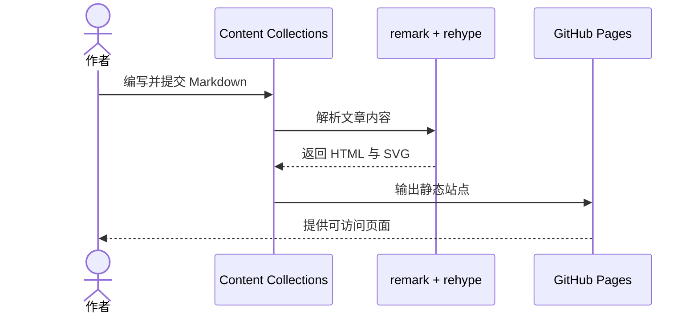
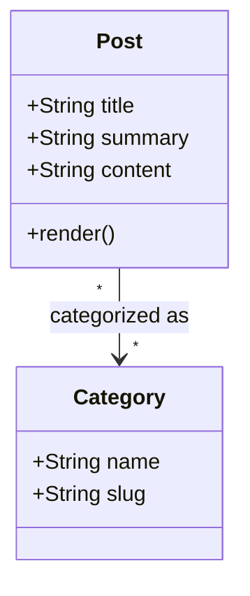
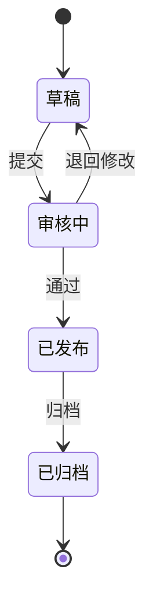
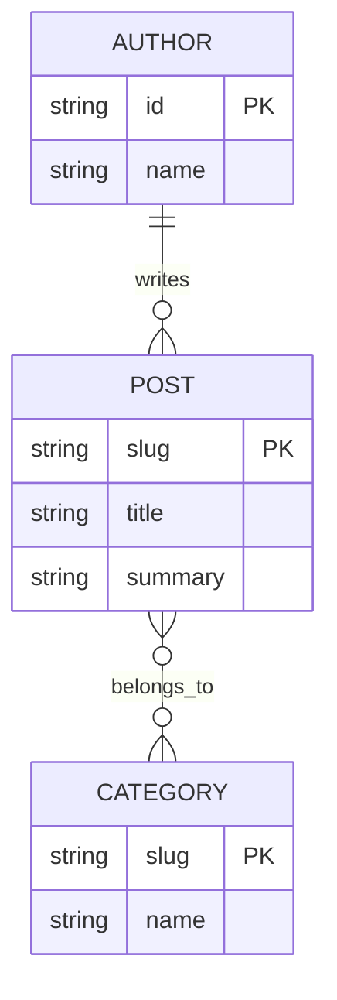
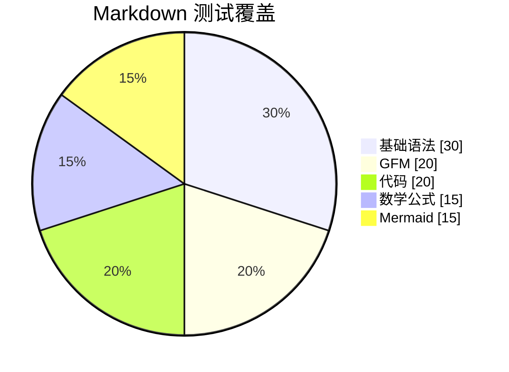

这是一篇用于验证 Markdown 渲染管线的综合测试文章，覆盖常用的
[CommonMark](https://commonmark.org/)、GitHub Flavored Markdown（GFM）、数学公式，以及中文与中英混排场景。

# 一级标题 Heading 1

## 二级标题 Heading 2

### 三级标题 Heading 3

#### 四级标题 Heading 4

##### 五级标题 Heading 5

###### 六级标题 Heading 6

Setext 一级标题
===============

Setext 二级标题
---------------

## 段落、换行与中英混排

这是一个普通段落。中文标点包括：逗号，句号。顿号、分号；冒号：问号？感叹号！以及“引号”、‘单引号’和《书名号》。

This paragraph mixes English、中文、数字 123、emoji 🚀、全角字符ＡＢＣ与半角 ABC。
一段很长且没有空格的中文文本用于验证浏览器自动换行：天地玄黄宇宙洪荒日月盈昃辰宿列张寒来暑往秋收冬藏闰余成岁律吕调阳云腾致雨露结为霜金生丽水玉出昆冈。

这一行后面有两个空格，因此产生硬换行。  
这是硬换行后的文字。

这一行使用反斜杠产生硬换行。\
这是另一个硬换行后的文字。

这两行在源码中相邻，只有普通换行，
浏览器中应当按软换行处理。

## 强调、删除线与行内语法

- _斜体 italic_
- **粗体 bold**
- ***粗斜体 bold italic***
- ~~GFM 删除线 strikethrough~~
- 中文紧邻强调：这是**重点内容**，这里是*轻度强调*。
- CJK 粗体边界：**该星号现在会被识别为粗体。**这是紧跟其后的中文。
- CJK 斜体边界：*括号里的斜体（也应正确结束）*这是紧跟其后的中文。
- CJK 删除线边界：~~该内容现在会被识别为删除线。~~这是紧跟其后的中文。
- 下划线不应破坏标识符：`snake_case_variable`。
- 行内代码：`const enabled = true`、`中文变量名`。
- 包含反引号的代码：``const marker = `code`;``。
- 转义字符：\*不是斜体\*、\# 不是标题、\[不是链接\]。
- HTML 实体：&copy;、&amp;、&lt;tag&gt;。
- 价格与美元符号：\$99，不应被解析为数学公式。

## 链接、自动链接与图片

- [普通链接](https://example.com)
- [带标题的链接](https://example.com "Example title")
- [引用式链接][reference-link]
- 尖括号自动链接：<https://example.com/docs>
- GFM URL 自动链接：www.example.com 和 https://github.com/ukeSJTU
- GFM 邮箱自动链接：hello@example.com
- 中文标点旁的链接：[上海交通大学](https://www.sjtu.edu.cn/)；链接后紧跟中文分号。


引用式图片：![同一个 Next.js 标志][next-logo]

## 引用块

> 这是一级引用。
>
> 引用中可以包含**粗体**、[链接](https://example.com)和列表：
>
> 1. 引用内的第一项
> 2. 引用内的第二项
>
> > 这是嵌套的二级引用。
> >
> > 中文引用与 English quote 可以共存。

## 无序、有序与嵌套列表

- 使用减号的无序列表
- 第二项
  - 二级项目
    - 三级项目
  - 回到二级
- 回到一级

* 使用星号的无序列表
* 另一项

+ 使用加号的无序列表
+ 另一项

1. 第一项
2. 第二项
   1. 嵌套有序项
   2. 另一个嵌套项
3. 第三项

4. 从数字 4 开始的列表
5. 下一项

## GFM 任务列表

- [x] 读取 Markdown
- [x] 启用 GFM
- [x] 渲染数学公式
- [x] 增加完整的代码高亮
- [ ] 继续测试更多真实文章
  - [x] 嵌套的已完成任务
  - [ ] 嵌套的未完成任务

## GFM 表格

| 功能 | 左对齐 | 居中 | 右对齐 |
| --- | :--- | :---: | ---: |
| 中文 | 上海交通大学 | 正常 | 100 |
| English | left | center | 200 |
| 转义管道 | A \| B | `x | y` | 300 |
| 强调 | **粗体** | ~~删除线~~ | `code` |

## GFM 脚注

这是一个中文脚注[^zh-note]，也是一个带多段内容的脚注[^long-note]。

脚注可以在中英文之间使用，例如 Markdown pipeline[^pipeline]。

[^zh-note]: 这是中文脚注内容，包含**强调**和[链接](https://example.com)。

[^long-note]: 第一段脚注内容。

    第二段脚注内容，使用缩进归属于同一个脚注。

[^pipeline]: Content Collections 在构建阶段将 Markdown 转换成 HTML。

## 代码

带语言标记的围栏代码块：

```ts
type Post = {
  title: string;
  summary: string;
};

const greeting: Post = {
  title: "你好，世界",
  summary: "GFM 与中文可以一起工作。",
};

console.log(greeting);
```

Shiki notation transformer（注释本身不会出现在渲染结果中）：

```ts
const before = "旧内容"; // [!code --]
const after = "新内容"; // [!code ++]
console.log(after); // [!code highlight]
console.error("错误示例"); // [!code error]
console.warn("警告示例"); // [!code warning]
console.info("信息示例"); // [!code info]
```

没有语言标记的代码块：

```
plain text
中文纯文本
```

使用波浪线的围栏代码块：

~~~json
{
  "message": "你好，JSON"
}
~~~

缩进代码块：

    pnpm dev
    pnpm build

## Mermaid 图表

以下图表分别验证时序图、类图、状态图、实体关系图和饼图，以及浅色、深色主题的同步切换。

### 时序图



### 类图



### 状态图



### 实体关系图



### 饼图



## 数学公式

行内公式可以嵌入中文句子：质能方程是 $E = mc^2$，圆的面积是 $A = \pi r^2$。

独立公式：

$$
\int_{-\infty}^{\infty} e^{-x^2} \, dx = \sqrt{\pi}
$$

包含分数、求和与上下标：

$$
\sum_{i=1}^{n} i = \frac{n(n+1)}{2}
$$

矩阵：

$$
A = \begin{bmatrix}
1 & 2 \\
3 & 4
\end{bmatrix}
$$

中文说明与公式之间不需要额外空格：设函数$f(x)=x^2$，则$f'(x)=2x$。

## 原始 HTML

下面的内容用于确认仓库内受信任 Markdown 的 HTML 支持：

<details>
  <summary>点击展开 details 元素</summary>
  <p>这是 <mark>高亮文字</mark>，键盘按键是 <kbd>⌘</kbd> + <kbd>K</kbd>。</p>
</details>

<!-- 这条 HTML 注释不应显示在页面中。 -->

## 分隔线

星号分隔线：

***

下划线分隔线：

___

减号分隔线：

---

以上内容构成当前 Markdown、GFM、数学与中文场景的回归测试集合。

[reference-link]: https://commonmark.org/ "CommonMark specification"
[next-logo]: /next.svg "Next.js logo from a reference definition"
